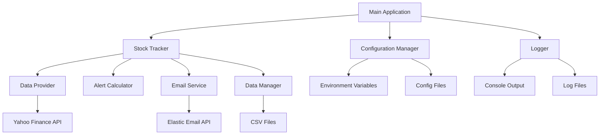
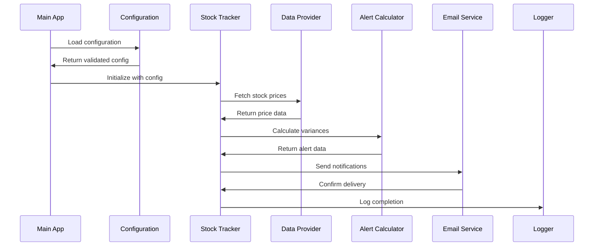
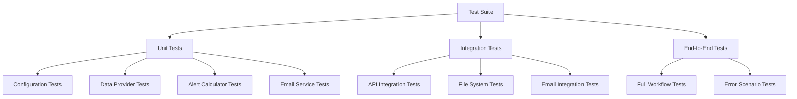

# Design Document

## Overview

The modernized stock tracker system will be built using a modular, object-oriented architecture that separates concerns into distinct components. The system will transform the existing monolithic scripts into a well-structured application with proper configuration management, comprehensive error handling, and extensive testing coverage.

The core architecture follows the Single Responsibility Principle, with separate classes handling configuration, data fetching, alert calculation, email notifications, and logging. This design enables easy testing, maintenance, and future extensibility.

## Architecture

### High-Level Architecture



### Component Interaction Flow



## Components and Interfaces

### 1. Configuration Management System

**Purpose:** Centralized configuration handling with validation and environment variable support.

**Key Classes:**
- `Config`: Main configuration container
- `EmailConfig`: Email-specific settings
- `TrackerConfig`: Stock tracking parameters
- `ConfigValidator`: Configuration validation logic

**Interfaces:**
```python
class ConfigInterface:
    def load_config(self) -> Config
    def validate_config(self, config: Config) -> List[str]
    def get_environment_config(self) -> Dict[str, str]
```

### 2. Stock Data Management

**Purpose:** Handle stock data fetching, processing, and storage with robust error handling.

**Key Classes:**
- `StockDataProvider`: Abstract base for data sources
- `YahooFinanceProvider`: Yahoo Finance implementation
- `DataManager`: File-based data persistence
- `StockPortfolio`: Portfolio management logic

**Interfaces:**
```python
class DataProviderInterface:
    def fetch_stock_data(self, symbols: List[str], days: int) -> pd.DataFrame
    def validate_symbols(self, symbols: List[str]) -> List[str]
    def get_historical_data(self, symbol: str, start_date: datetime, end_date: datetime) -> pd.DataFrame
```

### 3. Alert Calculation Engine

**Purpose:** Calculate price variances and determine when alerts should be triggered.

**Key Classes:**
- `AlertCalculator`: Main alert calculation logic
- `ThresholdManager`: Manage different alert thresholds
- `VarianceAnalyzer`: Analyze price movements
- `StagnationDetector`: Detect stagnant stocks

**Interfaces:**
```python
class AlertCalculatorInterface:
    def calculate_alerts(self, portfolio_data: pd.DataFrame) -> AlertSummary
    def check_thresholds(self, stock_data: StockData) -> List[AlertType]
    def analyze_stagnation(self, stock_data: StockData) -> Optional[StagnationAlert]
```

### 4. Email Notification System

**Purpose:** Send formatted email notifications with retry logic and error handling.

**Key Classes:**
- `EmailService`: Main email sending logic
- `EmailFormatter`: Format messages for different alert types
- `EmailTemplate`: Template management for HTML/text emails
- `DeliveryManager`: Handle retries and delivery confirmation

**Interfaces:**
```python
class EmailServiceInterface:
    def send_alert(self, alert_data: AlertSummary) -> bool
    def format_message(self, alerts: List[Alert]) -> EmailMessage
    def validate_recipients(self, recipients: List[str]) -> List[str]
```

### 5. Logging and Monitoring

**Purpose:** Comprehensive logging with structured output and performance monitoring.

**Key Classes:**
- `LoggerFactory`: Create configured loggers
- `PerformanceMonitor`: Track execution times and metrics
- `ErrorTracker`: Aggregate and analyze errors
- `HealthChecker`: System health monitoring

**Interfaces:**
```python
class LoggerInterface:
    def log_info(self, message: str, context: Dict[str, Any] = None)
    def log_error(self, message: str, exception: Exception = None)
    def log_performance(self, operation: str, duration: float)
```

## Data Models

### Core Data Structures

```python
@dataclass
class StockData:
    symbol: str
    current_price: float
    high_price: float
    high_date: datetime
    tolerance: float
    last_updated: datetime
    
@dataclass
class Alert:
    symbol: str
    alert_type: AlertType
    severity: AlertSeverity
    message: str
    percentage_drop: float
    days_since_high: int
    
@dataclass
class AlertSummary:
    tolerance_breaches: List[Alert]
    threshold_alerts: List[Alert]
    stagnation_alerts: List[Alert]
    total_alerts: int
    generated_at: datetime

@dataclass
class EmailMessage:
    subject: str
    text_body: str
    html_body: str
    recipients: List[str]
    sender: str
```

### Database Schema (CSV-based)

**investments.csv:**
- symbol (string, primary key)
- added_date (datetime)
- custom_tolerance (float, optional)

**stock_data.csv:**
- symbol (string, primary key)
- high_price (float)
- high_date (date)
- current_price (float)
- tolerance (float)
- last_updated (datetime)

**alert_history.csv:**
- alert_id (string, primary key)
- symbol (string)
- alert_type (string)
- severity (string)
- created_at (datetime)
- resolved_at (datetime, optional)

## Error Handling

### Error Categories and Strategies

1. **Configuration Errors**
   - Strategy: Fail fast with clear error messages
   - Recovery: Provide configuration templates and validation

2. **API Errors**
   - Strategy: Retry with exponential backoff
   - Recovery: Continue with cached data or skip failed symbols

3. **Data Processing Errors**
   - Strategy: Skip invalid records, continue processing
   - Recovery: Log errors and notify administrators

4. **Email Delivery Errors**
   - Strategy: Retry with different intervals
   - Recovery: Log to file if email fails completely

### Error Handling Implementation

```python
class ErrorHandler:
    def handle_api_error(self, error: APIError, context: Dict) -> ErrorAction
    def handle_data_error(self, error: DataError, context: Dict) -> ErrorAction
    def handle_email_error(self, error: EmailError, context: Dict) -> ErrorAction
    def log_error_metrics(self, error: Exception, context: Dict)
```

## Testing Strategy

### Test Architecture



### Testing Approach

1. **Unit Tests (80% coverage target)**
   - Mock external dependencies
   - Test individual component logic
   - Validate error handling paths
   - Test configuration validation

2. **Integration Tests**
   - Test component interactions
   - Validate data flow between components
   - Test with real file system operations
   - Mock external APIs with realistic responses

3. **End-to-End Tests**
   - Test complete workflows
   - Validate email generation and formatting
   - Test error recovery scenarios
   - Performance and load testing

### Test Data Management

- **Mock Data:** Realistic stock price data for testing
- **Test Fixtures:** Predefined portfolio configurations
- **Error Scenarios:** Simulated API failures and data corruption
- **Performance Data:** Large datasets for performance testing

## Security Considerations

### Security Measures

1. **Credential Management**
   - All API keys stored in environment variables
   - No credentials in code or logs
   - Secure credential validation

2. **Input Validation**
   - Validate all CSV input data
   - Sanitize email addresses
   - Validate stock symbols

3. **Data Protection**
   - Secure file permissions for data files
   - Temporary file cleanup
   - Encrypted email transmission

4. **Error Information**
   - Sanitized error messages
   - No sensitive data in logs
   - Secure error reporting

### Implementation

```python
class SecurityManager:
    def validate_input(self, data: Any) -> ValidationResult
    def sanitize_output(self, data: Any) -> Any
    def secure_file_operations(self, file_path: str) -> FileHandler
    def validate_credentials(self, credentials: Dict) -> bool
```

## Performance Optimization

### Optimization Strategies

1. **Batch Processing**
   - Batch API requests to reduce overhead
   - Process multiple stocks in parallel
   - Efficient data structure usage

2. **Caching**
   - Cache API responses for short periods
   - Cache configuration data
   - Reuse calculated values

3. **Memory Management**
   - Process large datasets in chunks
   - Clean up temporary data
   - Efficient pandas operations

4. **Async Operations**
   - Parallel API calls where possible
   - Async email sending
   - Non-blocking file operations

### Performance Monitoring

```python
class PerformanceMonitor:
    def track_execution_time(self, operation: str) -> ContextManager
    def monitor_memory_usage(self) -> MemoryStats
    def track_api_performance(self, provider: str) -> APIStats
    def generate_performance_report(self) -> PerformanceReport
```

## Deployment and Operations

### Deployment Architecture

- **Standalone Application:** Single executable with all dependencies
- **Configuration Management:** Environment-based configuration
- **Logging:** Structured logging with rotation
- **Monitoring:** Health checks and performance metrics

### Operational Requirements

1. **Scheduling:** Cron job or task scheduler integration
2. **Monitoring:** Log aggregation and alerting
3. **Backup:** Data file backup and recovery
4. **Updates:** Version management and rollback capability

### Production Considerations

- **Resource Requirements:** Memory and CPU usage optimization
- **Scalability:** Support for large portfolios
- **Reliability:** Graceful degradation and recovery
- **Maintenance:** Easy configuration updates and troubleshooting